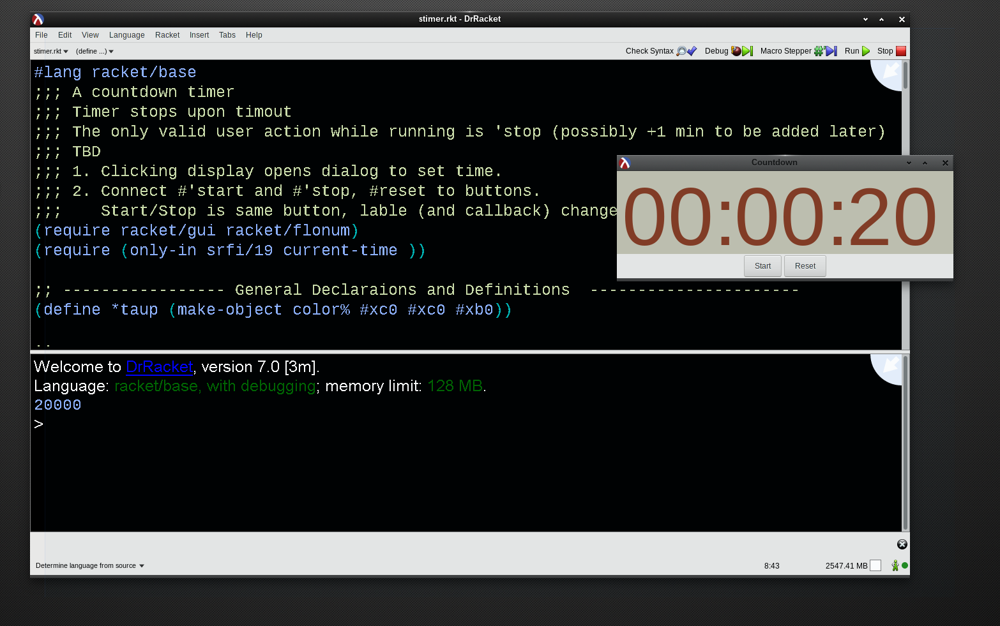

# Kcolc

**Kcolc is "Clock" (in reverse)**

## OVERVIEW

Until I can find a good generic timer application for Linux, I'm rolling my own. The plan is to prototype a countdown timer in various ways, beginning with an application in Racket Scheme. Ultimately there will be an app the has big numbers and is usable on any Linux X desktop--think of X Dali Clock, but as a timer. The functionalty is what you see in those web-based timers when Googling *countdown timer*.

## STATUS

The prototype in Racket scheme already functions as  countdown timer.  The next step it to add an alarm and an action (run a arbitrary user command) upon completion of the countdown.

